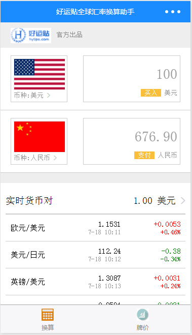
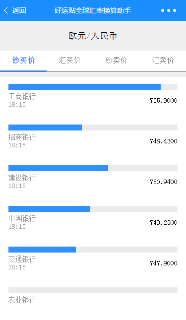
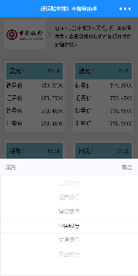

## 微信小程序：好运贴全球汇率换算助手

## 软件截图：
    

## 功能点：
* view、text等标签的基本运用
* wxss的基本运用
* this的指向运用
* 列表式渲染数据
* 带参数页面跳转
* picker标签的使用
* 自定义函数和调取
* wx.request()请求后台数据的运用
* 异步请求多个数据的运用
* 等等

## 扫码体验：
  

## Setup：
下载安装[Wechat DEV Tools](https://mp.weixin.qq.com/debug/wxadoc/dev/devtools/download.html), 并导入[项目](https://github.com/jacksplwxy/wechat-weapp-CurrencyConverter.git)

### Demo用于学习交流, 转载请注明出处

